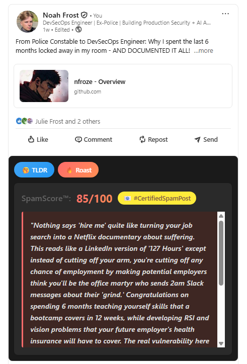
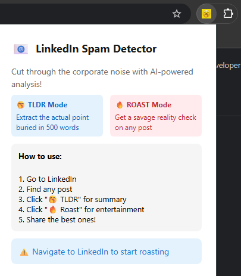

# 🌐 Project 6: Full Stack Chrome Extension with AI Integration

A Chrome extension that adds AI-powered TLDR summaries and savage roasts to LinkedIn posts

## What It Does

Two AI-powered features for any LinkedIn post:

### 🥱 TLDR Mode
- Cuts through the corporate fluff
- Extracts the actual point buried in 500 words
- Perfect for those "thought leader" novels

### 🔥 ROAST Mode  
- **SpamScore™** (0-100): How spammy is this post?
- **Savage Commentary**: What they're really saying
- **#CertifiedSpamPost📧**: Badge of dishonour for 80+ scores

## Screenshots

  
  
   
  
  
   
  
  
   
  

## How It Works

1. **Navigate** to any LinkedIn post
2. **Choose** your weapon:
   - Hit "🥱 TLDR" for a concise summary
   - Hit "🔥 ROAST" for entertainment value
3. **Extension** grabs the post text from the page
4. **Sends** it to my backend server
5. **Server** asks Claude AI to work its magic
6. **AI** either summarises or roasts (with SpamScore™)
7. **Results** appear right under the LinkedIn post
8. **Share** the best roasts with your network

All in ~2 seconds. No data stored. Pure stateless fun.

## Installation

**Chrome Web Store**: [Pending Approval]

**Manual Install**:
1. Download this repo
2. Chrome → Extensions → Developer mode ON
3. Load unpacked → Select the `extension` folder
4. Visit LinkedIn and start roasting

## Tech Stack

- **Frontend**: Vanilla JS Chrome Extension
- **Backend**: Express.js on Vercel  
- **AI**: Claude 3.5 Sonnet (Anthropic)
- **Architecture**: Extension → Vercel → Claude API → Brutal honesty

## The $5 Challenge 🔥

Using my personal API budget. Once it burns out, the extension dies.

Let's see how fast the internet can burn through $5 worth of roasts!

## Privacy

- No data stored
- No tracking
- No BS
- [Privacy Policy](./PRIVACY.md)

---

**Built by nfroze** | [GitHub](https://github.com/nfroze)

*Currently seeking opportunities in DevSecOps & Full-Stack Development*