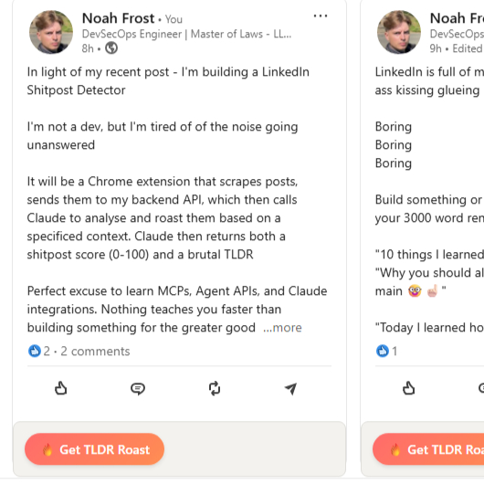
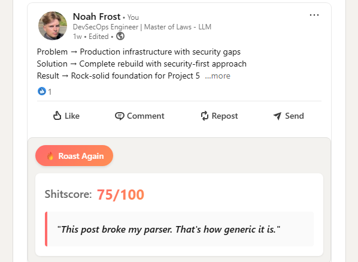
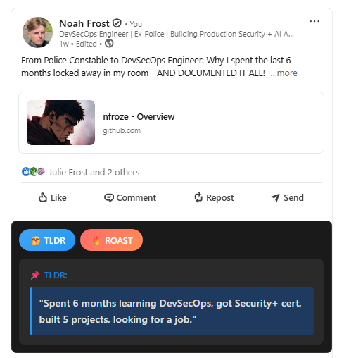

# 💩 Project 6: LinkedIn Shitpost Detector

A Chrome extension that uses AI to roast LinkedIn posts in one click

## What It Does

One-click AI analysis of any LinkedIn post:
- **Shitscore™** (0-100): How cringe is it?
- **Savage TLDR**: What they're really saying
- **#CertifiedShitPost💩**: Badge for 80+ scores

## Screenshots

  
  
  
  

## How It Works

1. **Click** the roast button on any LinkedIn post
2. **Extension** grabs the post text from the page
3. **Sends** it to my server
4. **Server** asks AI to analyze the post
5. **AI** scores the cringe and writes a roast
6. **Results** sent back to your browser
7. **Display** the roast right on the LinkedIn post
8. **Celebrate** or cringe at the verdict

All in ~2 seconds. No data stored. Pure stateless roasting.

## Installation

**Chrome Web Store**: [Pending Approval]

**Manual Install**:
1. Download this repo
2. Chrome → Extensions → Developer mode ON
3. Load unpacked → Select the `extension` folder
4. Go roast some LinkedIn posts

## Tech Stack

- **Frontend**: Vanilla JS Chrome Extension
- **Backend**: Express.js on Vercel  
- **AI**: Claude 3.5 Sonnet (Anthropic)
- **Architecture**: Extension → Vercel → Claude API → Savage roast

## The $5 Challenge 🔥

Using my personal API budget. Once it burns out, the extension dies.

Let's see how fast the internet can kill $5!

## Privacy

- No data stored
- No tracking
- No BS
- [Privacy Policy](./PRIVACY.md)

---

**Built by nfroze** | [GitHub](https://github.com/nfroze)

*Currently seeking opportunities in DevSecOps & Full-Stack Development*